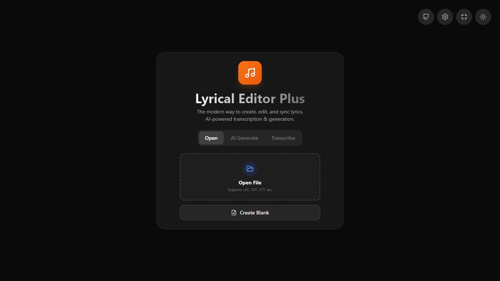
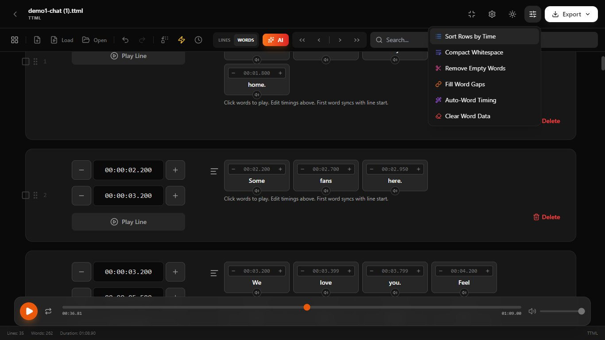
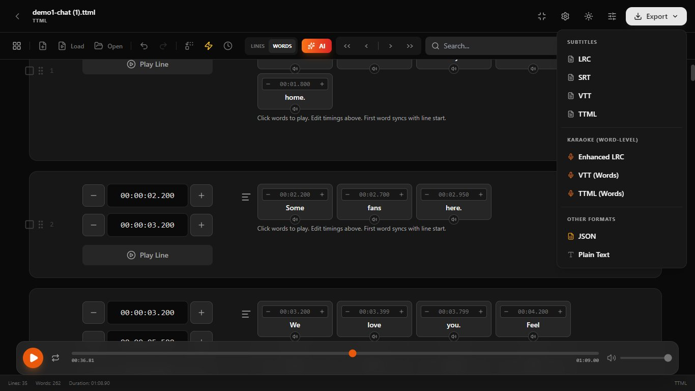

# Lyrical Editor Plus

**Universal Lyrics & Subtitle Editor**

A sleek, modern, and mobile-friendly web application for creating, editing, and synchronizing lyrics and subtitles. Built with React, Tailwind CSS, and powered by Google's Gemini AI for advanced transcription and generation features.



## Key Features

*   **Universal Format Support:** Import and export **LRC**, **SRT**, **VTT**, **TTML**, **JSON**, and **TXT** files.
*   **Media Synchronization:** Load audio or video files to visualize playback and synchronize timestamps in real-time.
*   **AI-Powered:**
    *   **Transcription:** Convert audio/video to text (Lines or Word-level karaoke) using Gemini AI.
    *   **Generation:** Create lyrics from scratch based on a prompt.
    *   **Refinement:** Translate, fix grammar, or restructure lyrics using the AI Assistant.
*   **Precision Editing:**
    *   **Line-Level:** Adjust start/end times for full lines.
    *   **Word-Level (Karaoke):** Switch to 'Word' view to edit individual word timings for Enhanced LRC or VTT Karaoke.
*   **Modern UI:** Fully responsive design with Dark/Light mode support.




## Tools & Functionality

The editor includes a suite of powerful tools accessible via the **Global Tools** menu (Sliders icon) and the bottom toolbar to streamline your workflow.

### Timing & Synchronization
*   **Media Player:** Integrated video/audio player with waveform-style visualization context.
*   **Tickers:** High-precision playback tracking.
*   **Quick Shift:** Shift all or selected timestamps forward/backward by 100ms or 500ms instantly.
*   **Shift Time Modal:** Apply a custom time offset (in milliseconds) to the entire file or specific selected rows.

### Karaoke & Word Data Tools
*   **Auto-Word Timing:** Automatically estimates word-level timestamps by splitting the line duration evenly across words. Useful as a starting point for karaoke.
*   **Fill Word Gaps:** Intelligently adjusts word start/end times to remove gaps between them, ensuring a continuous flow.
*   **Remove Empty Words:** Cleans up accidental empty entries in the word data.
*   **Clear Word Data:** Removes all word-level timing, reverting the specific lines back to simple subtitle lines.

### Text & Formatting
*   **Compact Whitespace:** Removes extra spaces and standardizes spacing across all lines.
*   **Find & Replace:** Quickly search for text and replace it across the entire document.
*   **Sort Rows by Time:** Re-orders cues chronologically based on their start time (useful after bulk edits).

### Export Options
*   **Subtitles:** Export as standard `SRT`, `VTT`, `TTML`, or `LRC` (Line only).
*   **Karaoke:** Export as `Enhanced LRC` (Word timestamps), `VTT` (Karaoke tags), or `TTML` (Span tags).
*   **Data:** Export as structured `JSON` or plain `TXT`.

## AI Assistant
Access the AI Assistant (Sparkles icon) to perform advanced operations:
1.  **Refine Lyrics:** Translate content, fix capitalization/grammar, or convert formatting.
2.  **Generate New:** Create completely new song lyrics based on a mood or topic.

## Setup

This project is built with React. To run it locally:

1.  Clone the repository.
2.  Install dependencies (e.g., `npm install`).
3.  Set your Google Gemini API key in the environment variables (`API_KEY`).
4.  Run the development server.

```bash
npm run dev
```

## Credits
Powered by **Google Gemini API** for generative AI capabilities.
