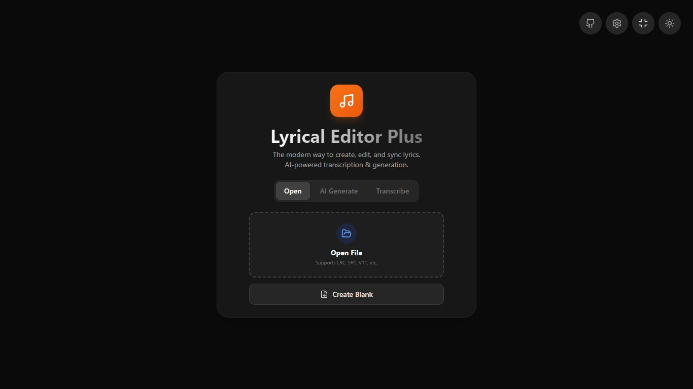
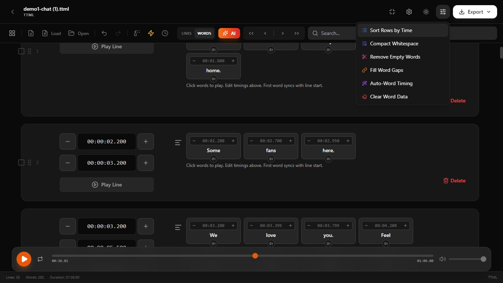

# Lyrical Editor Plus

**The Ultimate Modern Lyrics & Subtitle Editor**

Lyrical Editor Plus is a professional-grade, web-based tool designed for creators who need precision, speed, and flexibility. Built with a mobile-first approach, it offers a sleek, dark-mode-ready interface for editing **LRC**, **SRT**, **VTT**, **TTML**, and **YouTube SRV** files.

For a version with Web Speech API Text-to-Speech, use the `web-speech-api` branch.

Powered by **Google Gemini AI**, it automates tedious tasks like transcription, synchronization, and content generation.



## 🚀 Key Features

### 🎧 Universal Media & Format Support
*   **Formats:** Full support for `LRC` (Simple & Enhanced), `SRT`, `VTT`, `TTML`, `JSON`, `TXT`, and **YouTube SRV** formats (`SRV1`, `SRV2`, `SRV3`, including YouTube `JSON3` variants).
*   **Media Sync:** Load any audio or video file to visualize playback. The editor locks sync with your media for frame-perfect timing.
*   **Responsive Design:** Optimized for desktops, tablets, and mobile devices with a seamless **Light/Dark mode** toggle.

### 🤖 AI-Powered Intelligence
*   **Transcription:** Instantly convert audio/video to text using **Gemini 2.5 Flash** or **Gemini 3.0 Flash**. Choose between standard lines or **Word-Level Karaoke** mode.
*   **Creative Generation:** Generate lyrics from scratch based on a mood or topic using **Gemini 3.0 Pro**.
*   **Smart Refinement:** Use the AI Assistant to translate, fix grammar, or reformat lyrics with natural language instructions.

### 🎚️ Precision Editing Tools
*   **Karaoke Mode:** Deep dive into 'Word' view to adjust millisecond-level timing for individual words. Built-in support for YouTube word-level timing (`append="1"` and `<s>` tags).
*   **Text-to-Speech (TTS):** Built-in pronunciation checks. Click the speaker icon on any line or word to hear it spoken.
*   **Hot Fixes:** One-click tools to:
    *   Compact whitespace
    *   Fill gaps between words
    *   Remove empty entries
    *   Auto-generate word timings

### 🎹 Keyboard Shortcuts

| Key | Action |
| :--- | :--- |
| **Space** | Play / Pause Media |
| **Ctrl + Z** | Undo |
| **Ctrl + Shift + Z** | Redo |
| **- / _** | Nudge Time Backward (-100ms) |
| **+ / =** | Nudge Time Forward (+100ms) |

## 🛠️ Advanced Toolkit

Located in the **Global Tools** menu and bottom toolbar:

*   **Shift Time:** Bulk offset timestamps (e.g., +500ms) for the entire file or selected rows.
*   **Find & Replace:** Global text substitution.
*   **Looping:** Toggle repeat mode to focus on specific sections during playback.
*   **Sort Rows:** Chronologically reorder cues if they get out of sync.



## 📦 Export Options

*   **Subtitles:** `SRT`, `VTT`, `TTML`, `LRC`, `YouTube SRV1/SRV2/SRV3`
*   **Karaoke:** `Enhanced LRC`, `VTT (Karaoke)`, `TTML (Span tags)`, `YouTube SRV (Words)`
*   **Data:** `Structured JSON`, `TXT`

## 🔧 Setup & Installation

1.  Clone the repository.
2.  Install dependencies:
    ```bash
    npm install
    ```
3.  Create a `.env` file and add your Google Gemini API key:
    ```env
    GEMINI_API_KEY=your_google_api_key
    ```
4.  Start the development server:
    ```bash
    npm run dev
    ```

## 📄 License
MIT License.